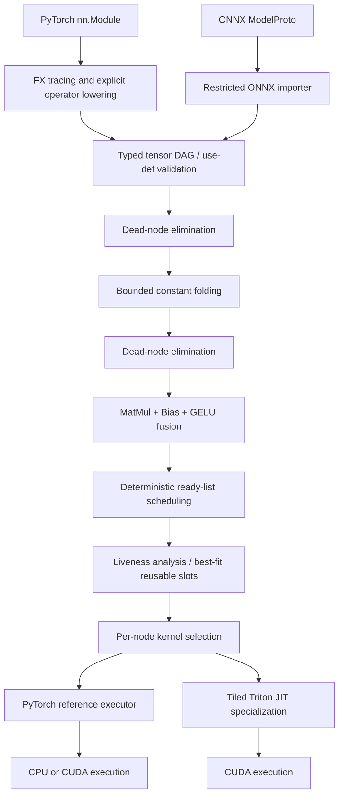
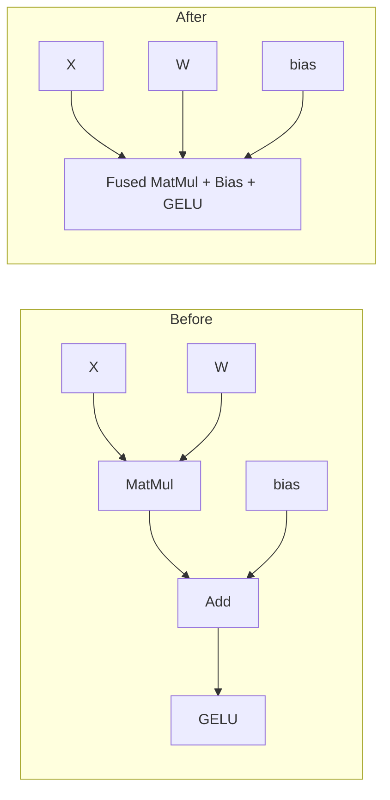
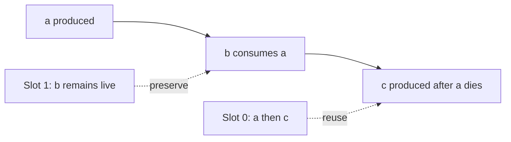
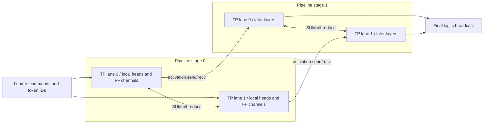
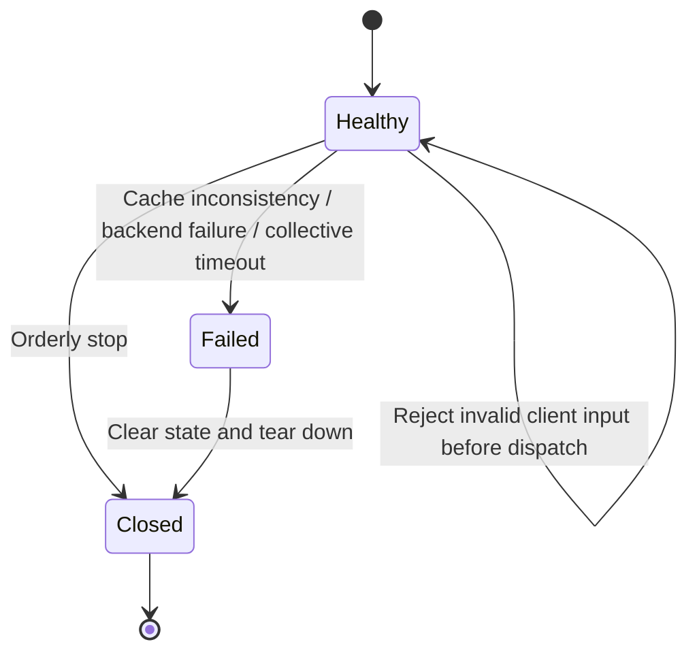
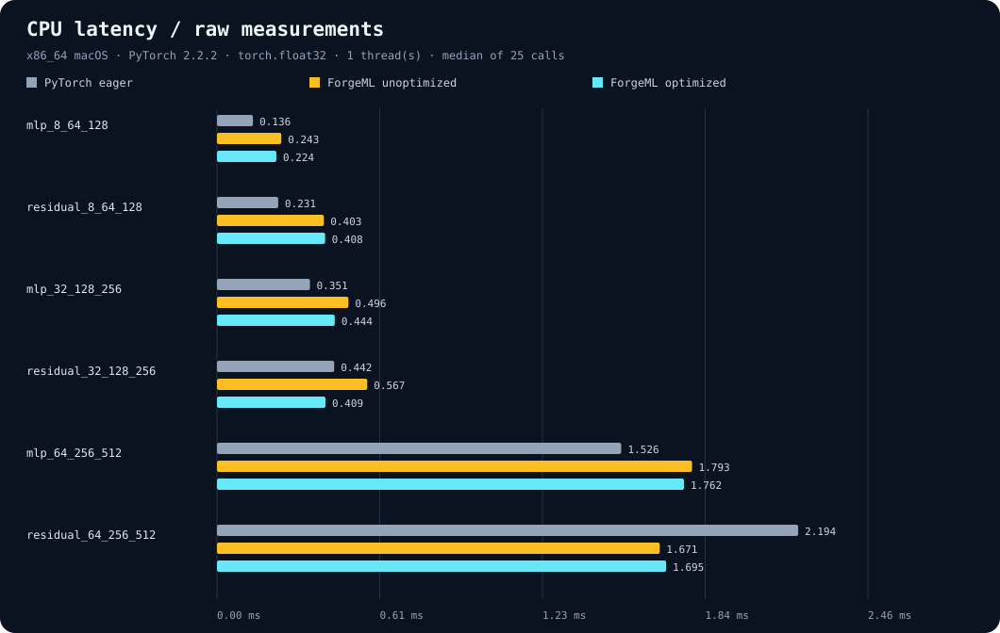
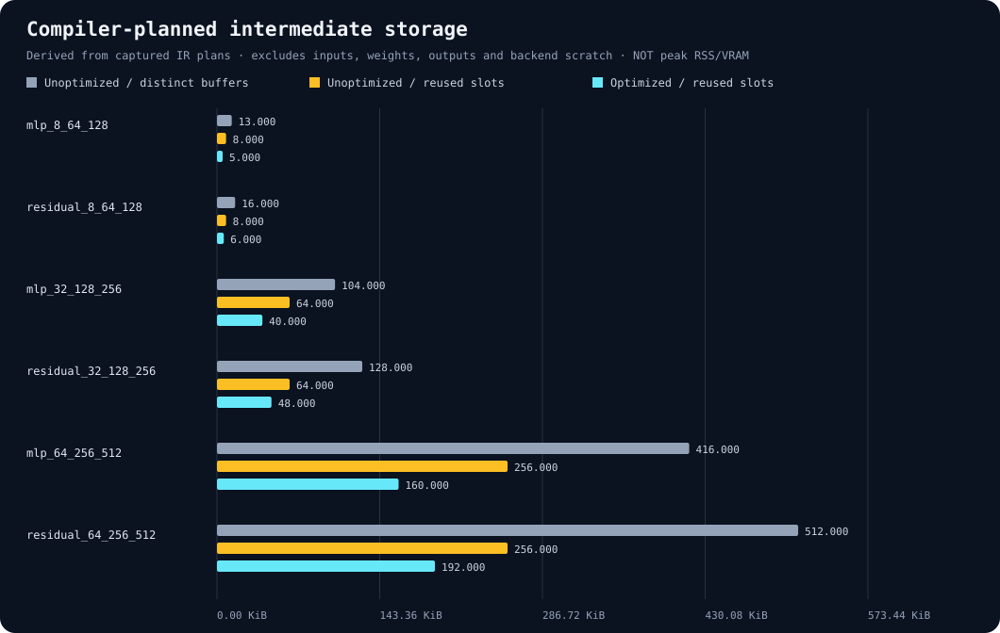

# ForgeML

### A small, inspectable ML compiler — with Nebula, a distributed decoder runtime

[](https://github.com/rayhankhilji/ForgeML/actions/workflows/ci.yml)

**From a PyTorch model to a typed graph, optimized execution plan, reusable activation slots, and specialized Triton kernels. From one decoder process to tensor- and pipeline-parallel inference.**

ForgeML is an executable systems project, not a wrapper around `torch.compile`. It implements its own graph representation, importers, transformation passes, scheduling heuristic, memory planner, kernel dispatch, and tuning loop. Nebula implements the complementary runtime problems: model partitioning, collective communication, autoregressive state, request admission, batching, and failures.

The two packages share a repository and measurement utilities. **Nebula is not secretly compiled by ForgeML:** its attention and distributed execution currently use PyTorch directly. ForgeML's supported compiler language is intentionally smaller than a complete transformer.

> **Evidence boundary.** CPU compiler measurements are checked in with raw samples and a source commit. Modern Linux dependency installation, correctness tests, and packaging run in GitHub Actions. CUDA/Triton and NCCL code is hardware-gated and has not been validated on NVIDIA hardware in this build environment. No GPU speedup, multi-GPU scaling result, production-readiness claim, or comparison with NVIDIA products is implied.

## Contents

- [Quick start](#quick-start)
- [Architecture](#architecture)
- [Compiler internals](#compiler-internals)
- [Triton lowering and autotuning](#triton-lowering-and-autotuning)
- [Nebula runtime](#nebula-runtime)
- [Measured compiler results](#measured-compiler-results)
- [Benchmarking and profiling](#benchmarking-and-profiling)
- [Free GPU notebook workflow](#free-gpu-notebook-workflow)
- [Validation, limitations, and extensions](#validation-limitations-and-extensions)

## Quick start

### Install

The primary development target is **Python 3.12 on Linux**. Python 3.11+ is declared. Use a virtual environment; the package has no hosted service, API key, or model-download requirement.

```bash
git clone https://github.com/rayhankhilji/ForgeML.git
cd ForgeML
python3.12 -m venv .venv
source .venv/bin/activate
python -m pip install -e '.[dev,onnx]'
pytest -q
python examples/compile_mlp.py
```

For NVIDIA execution, use Linux with a compatible NVIDIA driver and CUDA-enabled PyTorch:

```bash
python -m pip install -e '.[dev,onnx,gpu]'
pytest -q -m gpu
```

Core versions are pinned in `pyproject.toml`: PyTorch 2.14.0, NumPy 2.5.3; optional ONNX 1.22.0 and Triton 3.8.0. GPU tests skip without CUDA; **a green CPU CI badge does not validate GPU kernels**.

**Intel macOS caveat:** recent PyTorch releases do not ship Intel macOS wheels. The checked-in CPU measurements were captured with an explicitly separate compatibility environment, PyTorch 2.2.2 / NumPy 1.26.4 / Python 3.12.14. That old environment is not the recommended installation target. The declared modern stack is independently exercised on Linux CI. Apple GPU/MPS acceleration is not a validated backend.

### Compile a model

```python
import torch
from torch import nn
import forgeml

model = nn.Sequential(
    nn.Linear(64, 128),
    nn.GELU(approximate="tanh"),
    nn.Linear(128, 32),
).eval()

x = torch.randn(8, 64)
compiled = forgeml.compile(model, (x,), backend="auto")
y = compiled(x)
torch.testing.assert_close(y, model(x))

print(compiled.explain())
print(compiled.graph.to_mermaid())
```

`compile()` specializes to input shape, dtype, and device. Parameters are snapshotted, execution is inference-only, and returned tensors remain valid across subsequent calls. Changing the source model's weights does not change the compiled snapshot: compile again after a weight update.

```bash
forgeml explain
forgeml explain --mermaid
forgeml kernel-source
forgeml benchmark --device cpu --output artifacts/compiler.json
```

### Import ONNX

```python
import forgeml

graph = forgeml.from_onnx("model.onnx")
compiled = forgeml.compile(graph)
```

An optional tuple of example tensors can bind symbolic ONNX input dimensions. It cannot override declared fixed dimensions or dtypes. Import does not use ONNX Runtime. External-data tensors and custom operator domains are rejected.

### Generate with Nebula

```bash
python examples/nebula_generate.py --tokens 4
python examples/nebula_batching.py
```

For a two-process CPU correctness experiment:

```bash
torchrun --standalone --nproc-per-node=2 examples/nebula_generate.py --tp 2 --device cpu
```

For NVIDIA systems with the stated number of allocated GPUs:

```bash
torchrun --standalone --nproc-per-node=2 examples/nebula_generate.py --tp 2 --device cuda
torchrun --standalone --nproc-per-node=4 examples/nebula_generate.py --tp 2 --pp 2 --device cuda
torchrun --standalone --nproc-per-node=8 examples/nebula_generate.py --tp 8 --device cuda
```

These are **launch recipes, not claims that 2/4/8-GPU runs have been measured**. Nebula's decoder is initialized deterministically with random weights. It emits token IDs to test systems behavior, not meaningful language from a pretrained LLM.

## Architecture



| Layer | Implementation | Responsibility |
|---|---|---|
| IR | `src/forgeml/ir.py` | Typed values, validation, cloning, JSON and Mermaid inspection |
| Import | `src/forgeml/frontend.py` | FX / ONNX lowering with explicit semantic checks |
| Rewrites | `src/forgeml/passes.py` | Reachability, constant propagation, pattern fusion, scheduling |
| Storage | `src/forgeml/memory.py` | Live intervals and dtype/device-compatible reusable slots |
| Execution | `src/forgeml/compiler.py` | Input guards, slot allocation, dispatch, output ownership |
| GPU | `src/forgeml/kernels.py`, `_triton.py` | Kernel eligibility, tiled GEMM and fused epilogues |
| Tuning | `src/forgeml/autotune.py` | Correctness-gated candidate timing and per-instance selection |
| Distributed inference | `src/nebula/` | Decoder sharding, command protocol, caches, batching, routing |
| Measurement | `measurement.py`, compiler/runtime benchmark modules | Raw samples, provenance, correctness gates, scaling definitions |

There is no dependency on TVM, MLIR, TensorRT, or Inductor. Triton itself performs the GPU machine-code compilation; ForgeML owns the graph-level decisions and the specialized kernel template/launch parameters. It does not implement a new CUDA assembler.

## Compiler internals

### 1. A deliberately small tensor language

The graph is a static, SSA-like tensor DAG: every named intermediate has one producer and must be defined before use. A `TensorSpec` contains `(shape, dtype, device)`; a `Node` contains `(name, op, inputs, attrs, spec)`.

For each node, spec inference runs the whitelisted operation on meta tensors and checks the declared result. Validation catches missing values, duplicate definitions, bad arity, unsupported attributes, incompatible dimensions, dtype/device mismatches, and invalid outputs before ordinary execution.

| Source construct | Lowering / restriction |
|---|---|
| `nn.Linear`, `F.linear` | Rank-2 matmul plus optional bias; constant weight snapshot |
| `matmul`, `mm`, `@` | Rank-2 operands only |
| Add / multiply | Broadcasting; scalar operands; no in-place mutation or `out=` import |
| ReLU | Non-in-place only |
| GELU | Exact `none` or `tanh` approximation |
| Reshape / view | Static dimensions; one inferable `-1` |
| Transpose / `t()` | Dimension swap; `t()` restricted to rank 2 |
| Softmax | Explicit static axis; dtype override rejected |
| Outputs | One tensor or a flat tensor tuple |
| ONNX | Default domain, opsets 13–22; Gelu requires 20+ |

ONNX additionally supports `Gemm` alpha/beta/transposition lowering, `Constant`, and `Identity`. ONNX transpose is restricted to identity or a single dimension swap. Reshape needs a constant int64 shape and `allowzero=0`; zeros copy corresponding input dimensions. Unsupported operations fail explicitly instead of being silently executed through an opaque fallback importer.

**Not supported:** training, gradients through compiled execution, dynamic control flow, general dynamic shapes, convolution, arbitrary Python side effects, nested output structures, arbitrary ONNX domains, or a general transformer operator set. FX tracing executes Python from the supplied module: compile only trusted Python models.

### 2. Dead-node elimination and constant folding

Dead-node elimination starts at observable graph outputs and traverses producer dependencies backward. Unreachable operators and constants are discarded; the public input signature is retained.

Constant folding evaluates a pure node only when all its operands are known constants. The predicted result must fit a **64 MiB per-result folding budget**, checked before allocation. This is a per-result bound, not a total compiler-memory sandbox.

For a graph $G=(V,E)$, backward reachability is $O(|V|+|E|)$. Tensor evaluation and snapshot copying add costs proportional to the actual operations and tensor bytes; the Python compiler is intentionally not a zero-copy production frontend.

### 3. Semantics-preserving epilogue fusion



The rewrite recognizes

$$Y=\operatorname{GELU}(XW+b),\qquad X\in\mathbb{R}^{M\times K},\quad W\in\mathbb{R}^{K\times N},\quad b\in\mathbb{R}^{N}.$$

Both eliminated intermediates must have exactly one consumer and must not be graph outputs. A shared matmul, observable pre-activation, or non-vector bias blocks this transformation. The terminal node's name, output spec, and GELU mode are preserved.

On the Torch backend this is **graph fusion, not one CPU kernel**. On the Triton path, the tile accumulator, bias addition, and activation are handled within one kernel invocation. Thus graph simplification and hardware fusion are different claims.

### 4. Operator scheduling

A deterministic topological ready list prioritizes operations using

$$\operatorname{score}(v)=\operatorname{bytesFreedByLastUses}(v)-\operatorname{bytesProduced}(v).$$

Only intermediate values whose remaining consumer count reaches zero contribute to freed bytes. Inputs, constants, and observable outputs are not counted as released storage. Original graph order breaks ties.

This heuristic is not an optimal-register-allocation solver or an asynchronous stream scheduler. The simple ready-list scan can take quadratic time in the number of nodes, which is acceptable for the miniature graphs targeted here.

### 5. Lifetime-based activation reuse

An intermediate $v$ has a closed live interval

$$I_v=[\operatorname{produce}(v),\operatorname{lastUse}(v)].$$

A slot can be reassigned only when

$$\operatorname{lastUse}(u)<\operatorname{produce}(v),$$

with matching dtype and device and sufficient capacity. The **strict inequality** prevents an operator from overwriting one of its own live operands. A best-fit search chooses the smallest compatible retired slot.



`MemoryPlan.naive_bytes` sums distinct **internal intermediate** buffers. `planned_bytes` sums reusable slot capacities over the same scope. Neither includes inputs, constants, graph outputs, PyTorch scratch tensors, CUDA allocator fragmentation, or the compiler's weight snapshots. These are plan statistics, **not measured peak RSS or VRAM**.

Execution uses a fresh slot arena per invocation. Output views are materialized before an underlying slot can be reused. Returned tensors do not borrow mutable scratch storage. This trades some copying and allocation overhead for a simple, explicit ownership contract.

## Triton lowering and autotuning

### Tiled matrix multiplication

A program instance computes a $B_M\times B_N$ output tile, accumulating over chunks of size $B_K$:

$$C_{ij}=\sum_{r=0}^{\lceil K/B_K\rceil-1}A_{i,r}B_{r,j}.$$

The implementation includes masked loads/stores for ragged dimensions, explicit operand strides, a strided bias vector, FP32 accumulation, and an optional fused GELU epilogue. FP32 dot products request IEEE precision rather than silently enabling TF32. BF16 requires appropriate NVIDIA hardware.

GELU is supported as

$$\operatorname{GELU}(x)=\tfrac12x\left(1+\operatorname{erf}(x/\sqrt2)\right)$$

or

$$\operatorname{GELU}_{\tanh}(x)=\tfrac12x\left[1+\tanh\left(\sqrt{2/\pi}(x+0.044715x^3)\right)\right].$$

For low-precision inputs, the fused kernel deliberately rounds the matmul and bias-add intermediates back to the source dtype before the activation. Removing those rounding points would change the unfused numerical contract, even if it sometimes improved accuracy relative to real arithmetic.

### Kernel selection

| Backend | Behavior |
|---|---|
| `torch` | All operations use the reference executor |
| `auto` | Eligible CUDA matmul/fused nodes use Triton when available; other nodes use Torch |
| `triton` | Requires CUDA and Triton; uses an explicit mixed plan for the supported kernel subset |

The actual per-node selection is visible in `compiled.explain()["kernel_plan"]`. A selected kernel that fails does not silently fall back and manufacture a successful GPU benchmark.

### Autotuning

```python
model = model.cuda()
x = x.cuda()
compiled = forgeml.compile(model, (x,), backend="triton")
tuning_report = compiled.autotune(x, warmup=3, repeats=10)
y = compiled(x)
```

Four bounded tile/warp/stage configurations are tested. Each candidate must pass a finite-output and numerical comparison gate before entering timing. Warmups are excluded; candidate order rotates between repetitions; the lowest measured median wins. Raw candidate timings and rejected numerical comparisons are returned.

Selections are stored **only on that compiled model instance**. There is no persistent, cross-device tuning cache whose stale key could be confused with evidence from another GPU. Compilation/resource failures surface rather than becoming fictitious infinite-latency samples. The tuner is intentionally small; it is not a Bayesian search, exhaustive autotuner, or guarantee of beating cuBLAS.

## Nebula runtime

### Model and execution contract

Nebula uses a deterministic, pre-normalized causal decoder:

$$x_0=E_{\mathrm{token}}(t)+E_{\mathrm{position}}(p),$$
$$u_l=x_l+\operatorname{Attention}(\operatorname{LN}(x_l)),$$
$$x_{l+1}=u_l+W_{\mathrm{down}}\operatorname{GELU}_{\tanh}(W_{\mathrm{up}}\operatorname{LN}(u_l)).$$

Separate Q/K/V projections, learned positional embeddings, final LayerNorm, and an untied vocabulary projection make the computation easy to inspect. Generation is greedy, fixed-length, and returns **new token IDs only**. No pretrained model quality, tokenizer compatibility, or stochastic sampling quality is being benchmarked.

### Tensor and pipeline parallelism



With tensor-parallel degree $T$, Q/K/V output channels are sharded by attention head. The corresponding output-projection input columns are sharded. Feed-forward expansion channels are split similarly. Each rank computes a partial projection, and SUM all-reduce reconstructs the residual-width result:

$$Y=\sum_{r=0}^{T-1}X_rW_r.$$

Each decoder layer uses one TP reduction after attention and one after its feed-forward projection. LayerNorm parameters and residual streams are replicated within a TP group.

With pipeline degree $P$, contiguous layer ranges are assigned to stages. Rank mapping is

$$\mathrm{tpRank}=\mathrm{rank}\bmod T,\qquad\mathrm{ppRank}=\lfloor\mathrm{rank}/T\rfloor,\qquad\mathrm{worldSize}=TP.$$

Layer count must divide by $P$; hidden/head and feed-forward partition dimensions must divide by $T$. CPU collectives use Gloo; CUDA collectives use NCCL.

**Pipeline limitation:** stages use blocking send/receive, one forward traversal at a time. There is no overlapping microbatch pipeline schedule. Every TP lane transfers its replicated activation to the next stage. This is real partitioned execution, but not a throughput-optimized pipeline.

### KV-cache coordination

Each rank owns only its local layers' and local heads' keys and values. Request IDs and positions are coordinated by the leader. Appends validate ownership, uniqueness, capacity, shape, dtype, device, and expected position. A decode query at absolute position $p$ can attend only to keys with $k\le p$; treating a cached decode as a fresh causal sequence would produce the wrong mask.

For batch $B$, reserved sequence capacity $S$, $L$ layers, $h$ heads, head dimension $d_h$, and element size $w$, the planned cache capacity per rank is

$$M_{\mathrm{KV,rank}}=2\frac{L}{P}BS\frac{h}{T}d_hw.$$

The factor two accounts for K and V. Storage is contiguous, allocated per active request; this is **not paged attention**, prefix sharing, cache migration, or cross-replica cache coherence. Request completion releases local state on all participating ranks.

Weight initialization builds a deterministic full CPU reference model temporarily, clones the owned shards, and drops the reference. Persistent device weights are sharded, but the loader itself is not suitable for models that exceed one host's memory.

### Leader/worker protocol and failures

Rank zero issues fixed integer-tensor commands for step, release, and stop. Payloads carry bounded dimensions, request IDs, token IDs, and positions. Worker ranks call `serve()`. The protocol does not serialize Python objects through distributed pickle collectives.



A rank failure or partial cache mutation is not safely recoverable merely by rerunning the same token. The engine therefore becomes unavailable and clears state. Process-group timeouts bound many communication failures; `torchrun` supervises worker processes. There is no elastic membership, checkpoint restore, exactly-once distributed execution, or transparent in-flight replay.

Use trusted worker networks: tensor-only messages avoid object unpickling, but this is not an authenticated, encrypted network service.

### Batching and request routing

`AsyncBatcher` admits a bounded number of outstanding requests, collects compatible requests within a short batching window, and serializes engine calls outside the event loop. Compatibility includes prompt length and requested output length; unlike padded batching, this does not introduce an unimplemented attention mask.

`RequestRouter` selects healthy, least-pending replicas with round-robin tie-breaking. A full admission queue can cause an unstarted request to select another replica; a backend failure does not trigger an unsafe automatic retry of already-started work.

The batcher handles cancellation, client timeouts, backpressure, and orderly closure. Cancelling a client future cannot cancel a GPU kernel or roll back distributed cache mutation; already-running work must finish or fail through the engine's failure boundary.

This is dynamic **request microbatching**, not continuous token-level admission or a networked production serving platform. The example router runs in-process over independent engines; an HTTP gateway, authentication layer, replica provisioning, and a multi-node control plane are outside the project.

## Measured compiler results

The following is one development-host capture, not a controlled hardware leaderboard. All six workloads passed eager-output comparison before timing.

- **Source:** clean commit `4ee14c979daa5aedb3327bec24017db911fe112b`.
- **Host:** x86_64 macOS; Python 3.12.14; PyTorch 2.2.2; CPU FP32; one Torch thread.
- **Method:** 5 warmups, 25 measured calls per variant, rotating variant order, synchronized host wall-clock timing.
- **Scope:** whole invocation, including Python dispatch and output ownership; compilation and tuning excluded.
- **Noise:** the raw p95 values show substantial tail variability. No confidence intervals or repeat-run stability claim is made.



| Workload `batch_width_hidden` | Eager median ms | ForgeML median ms | ForgeML p95 ms | Eager / ForgeML |
|---|---:|---:|---:|---:|
| `mlp_8_64_128` | 0.136 | 0.224 | 0.442 | 0.606× |
| `residual_8_64_128` | 0.231 | 0.408 | 0.976 | 0.566× |
| `mlp_32_128_256` | 0.351 | 0.444 | 0.985 | 0.790× |
| `residual_32_128_256` | 0.442 | 0.409 | 1.171 | 1.080× |
| `mlp_64_256_512` | 1.526 | 1.762 | 8.238 | 0.866× |
| `residual_64_256_512` | 2.194 | 1.695 | 35.525 | 1.294× |

A ratio below one is a **slowdown**. These results do not support a blanket CPU speedup claim. Small workloads expose Python dispatch, allocation, and copying overhead; identifying the precise contribution of each requires profiling. Large tail latency makes the apparent improvements in two rows especially unsuitable as headline claims.



The memory chart is reconstructed from the captured IR and slot plans, not from an RSS/VRAM sensor. For the smallest MLP, distinct intermediate storage totals 13 KiB, unoptimized slot planning uses 8 KiB, and optimized slot planning uses 5 KiB. For every standard MLP, the five original compute nodes become three; each residual MLP goes from six to four.

Raw samples, plans, correctness tolerances, environment details, and a SHA-256-linked summary are available in [`benchmarks/results/`](benchmarks/results/). The rendering utility rechecks stored medians, sample counts, storage totals, slot capacities, and lifetime overlap before drawing figures. It reads the captured report; it does not rerun the workload to make a nicer chart.

**No measured GPU or 2/4/8-GPU scaling figures are published.** The illustrative scaling values in the original project idea are not experimental results.

## Benchmarking and profiling

### Compiler

```bash
forgeml benchmark --device cpu --backend torch --warmup 5 --repeats 25 --threads 1 --output artifacts/compiler-cpu.json
forgeml benchmark --device cuda --backend triton --dtype float16 --autotune --warmup 10 --repeats 100 --output artifacts/compiler-gpu.json
python -m forgeml.reporting artifacts/compiler-cpu.json --output-dir artifacts/figures
```

The compiler suite compares eager, unoptimized IR, and optimized IR on MLP and residual-MLP shapes. It reports raw sample arrays, median, linearly interpolated p95, compilation cost, correctness errors, kernel plans, and logical storage statistics. Autotuning itself is excluded from steady-state timings and reported separately.

Numerical gates use `(rtol, atol)` of `(1e-4, 1e-4)` for FP32, `(1e-2, 1e-2)` for FP16, and `(5e-2, 5e-2)` for BF16. Non-finite outputs fail. These are small-workload validation tolerances, not formal floating-point error bounds.

### Nebula strong scaling

Use the same model, total batch, prompt length, generated token count, precision, source commit, and hardware class for every point:

```bash
python -m nebula.benchmarks benchmark --device cuda --output artifacts/nebula-1.json
torchrun --standalone --nproc-per-node=2 -m nebula.benchmarks benchmark --device cuda --tp 2 --output artifacts/nebula-2.json
torchrun --standalone --nproc-per-node=4 -m nebula.benchmarks benchmark --device cuda --tp 4 --output artifacts/nebula-4.json
torchrun --standalone --nproc-per-node=8 -m nebula.benchmarks benchmark --device cuda --tp 8 --output artifacts/nebula-8.json
python -m nebula.benchmarks compare artifacts/nebula-1.json artifacts/nebula-2.json artifacts/nebula-4.json artifacts/nebula-8.json --output artifacts/scaling.json
```

Run from a clean recorded commit. The comparison utility rejects unmatched model/workload/runtime/hardware signatures, failed correctness gates, duplicate topologies, missing baselines, dirty-source captures, and medians that disagree with their raw samples. A human must still ensure the physical hardware and interference conditions are comparable; metadata cannot prove that for you.

For fixed work,

$$S_p=\frac{T_1}{T_p},\qquad E_p=\frac{S_p}{p},\qquad Q_p=\frac{B\,N_{\mathrm{new}}}{T_p}.$$

$S_p$ is speedup, $E_p$ parallel efficiency, and $Q_p$ generated-token throughput. The benchmark measures leader-observed generation latency, prefill calls, and decode steps separately. It checks prefill/decode logits against a monolithic reference and checks the complete greedy continuation before collecting timing samples.

**CPU multiprocess runs validate distributed semantics; they do not measure GPU scaling.** On small decoders, communication and Python overhead can make additional ranks substantially slower.

### Why scaling is not linear

A useful decomposition is

$$T_p\approx T_{\mathrm{compute}}/p+T_{\mathrm{communication}}+T_{\mathrm{synchronization}}+T_{\mathrm{scheduling}}+T_{\mathrm{serial}}.$$

For a ring all-reduce of $n$ bytes across $T$ ranks, a simplified latency/bandwidth model is

$$T_{\mathrm{allreduce}}\approx2(T-1)\alpha+2\frac{T-1}{T}n\beta,$$

where $\alpha$ is per-step latency and $\beta$ is seconds per byte. This is an explanatory model, not a claim that a particular NCCL run selects a ring algorithm.

Decode often has insufficient work per token to amortize two TP collectives per layer. KV traffic grows with context length; stage imbalance and blocking PP transfers add idle time; replicated logits and command broadcasts add communication. Faster kernels can even expose a larger *fraction* of communication overhead.

Collect a separate trace rather than mixing profiler overhead into benchmark samples:

```bash
python -m nebula.benchmarks profile --device cpu --output artifacts/trace
torchrun --standalone --nproc-per-node=2 -m nebula.benchmarks profile --device cuda --tp 2 --output artifacts/trace-gpu
```

Each rank writes a Chrome trace. Inspect attention, feed-forward work, KV appends, TP reductions, PP sends/receives, allocations, and synchronization. Trace regions overlap and include waiting: do not add every region's duration and call the sum end-to-end latency.

## Free GPU notebook workflow

**Kaggle is the practical first place to check** for a free session that may expose two T4 GPUs. Allocation, quotas, verification requirements, and available accelerators are account-dependent: inspect the notebook's accelerator selector and remaining quota. A generous free allocation is not a capacity guarantee, and it does not provide a reproducible 4/8-GPU cluster.

1. Create a notebook using your own account, enable internet if permitted, and select an eligible NVIDIA accelerator. For two-GPU experiments, verify that the session actually exposes two devices.
2. Clone this repository in the notebook. Inspect `nvidia-smi`, `torch.__version__`, `torch.version.cuda`, `torch.cuda.device_count()`, and the installed Triton version before changing the environment.
3. Prefer a notebook's working CUDA/PyTorch pairing over blindly upgrading its driver-sensitive stack. For an explicit compatibility experiment, install the project with `python -m pip install --no-deps -e .`, then install missing test/import tools. This preserves provider packages but is **not the pinned reference environment**; run the correctness tests and record the actual versions.
4. Run `pytest -q -m gpu`. A skipped GPU suite is not validation. T4-class hardware does not support the BF16 kernel path; use FP16 or FP32.
5. Run the compiler CUDA benchmark. On a verified two-GPU session whose rules permit the workload, use the two-rank Nebula launch recipe and save raw JSON plus profiler traces.
6. Download artifacts before the ephemeral session ends. Never commit provider credentials, account tokens, or private data.

[Colab's official FAQ](https://research.google.com/colaboratory/intl/en-GB/faq.html) states that free GPU resources are not guaranteed and restricts distributed computing workers on its free tier. Use it, if available, for permitted interactive single-GPU compiler experiments — **not as a workaround for a free distributed cluster**. This repository does not create accounts, bypass quotas, or provision paid resources.

## Validation, limitations, and extensions

### Verification commands

```bash
ruff check src tests examples
ruff format --check src tests examples
pytest -q
pytest -q -m distributed
pytest -q -m gpu
python -m build
```

Tests cover IR rejection paths, FX/ONNX lowering, exact and approximate activation semantics, parameter snapshots, fusion boundaries, constant-fold budgets, scheduling invariants, lifetime reuse, output aliasing, kernel selection, measurement definitions, KV-cache invariants, decoder parity, batching and routing behavior, and distributed process topologies. Hardware-gated checks remain visibly skipped without their required hardware.

### Deliberate boundaries

| Area | Implemented scope | Not claimed |
|---|---|---|
| Compiler | Static typed DAG and explicit small operator set | General PyTorch compatibility or a mature optimizing compiler |
| GPU codegen | Tiled GEMM / fused bias-GELU Triton template | Handwritten CUDA, arbitrary graph-to-one-kernel fusion, or cuBLAS superiority |
| Memory | Per-call intermediate-slot reuse | Whole-process peak-memory reduction or zero allocation |
| Autotuning | Four correctness-gated candidates per compiled instance | Global optimality or a portable persisted tuning database |
| Model | Small deterministic causal decoder | Pretrained LLM quality or Hugging Face checkpoint loading |
| Parallelism | TP collectives and blocking PP partitioning | Overlapped pipeline throughput, elastic resizing, or automatic placement |
| KV cache | Per-request, per-rank contiguous storage | Paged attention, prefix caching, cache transfer, or speculative decoding |
| Serving | Bounded in-process batching and replica selection | Public HTTP service, authentication, multi-tenant isolation, or continuous batching |
| Failure handling | Explicit failure, cleanup, bounded communication waits | Transparent recovery of partially executed requests |
| Results | Raw CPU compiler capture and reproducible GPU commands | Invented GPU timing or unmeasured scaling efficiency |

The next substantive extensions would be symbolic shape constraints, a richer attention-capable IR, cost-model-guided fusion, CUDA graph capture, paged KV storage, pipeline microbatch overlap, vocabulary parallelism, and controlled GPU measurements. Each should add an executable contract and a regression test before a performance claim.

### Reading and contributing

Start with `ir.py`, then `passes.py`, `memory.py`, and `compiler.py`. For distributed execution, read `model.py`, `parallel.py`, `cache.py`, `runtime.py`, then `scheduler.py`. Project-specific development commands and invariants are recorded in `AGENTS.md`.

A useful contribution includes a small reproducer, an eager/reference correctness check, boundary cases, and raw measurements if performance is the motivation. Do not replace a failed GPU run with a CPU fallback and retain the GPU label. Do not remove slow workloads from a published comparison.

Relevant foundations:

- [Triton's matrix multiplication tutorial](https://triton-lang.org/main/getting-started/tutorials/03-matrix-multiplication.html): tiling, pointer arithmetic, and kernel specialization.
- [PyTorch distributed applications tutorial](https://docs.pytorch.org/tutorials/intermediate/dist_tuto.html): process groups, point-to-point communication, and collectives.
- The source and tests in this repository are the authoritative specification of the implemented subset.

## License

MIT. See [LICENSE](LICENSE).
