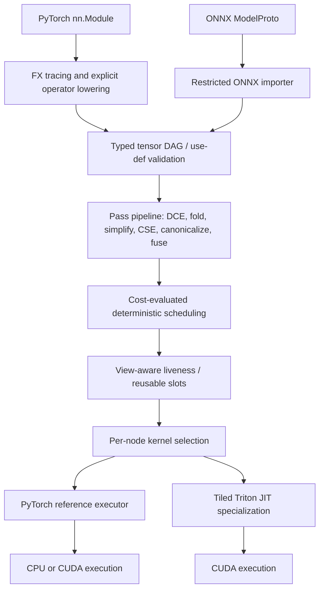
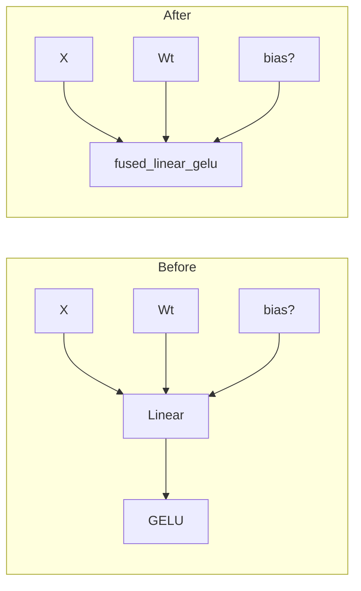
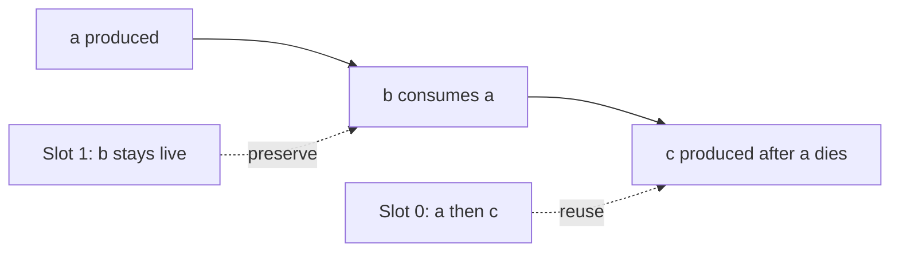
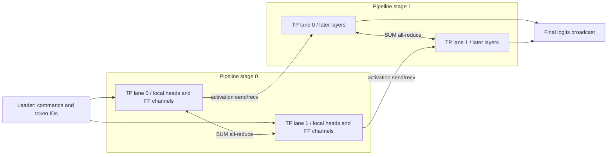
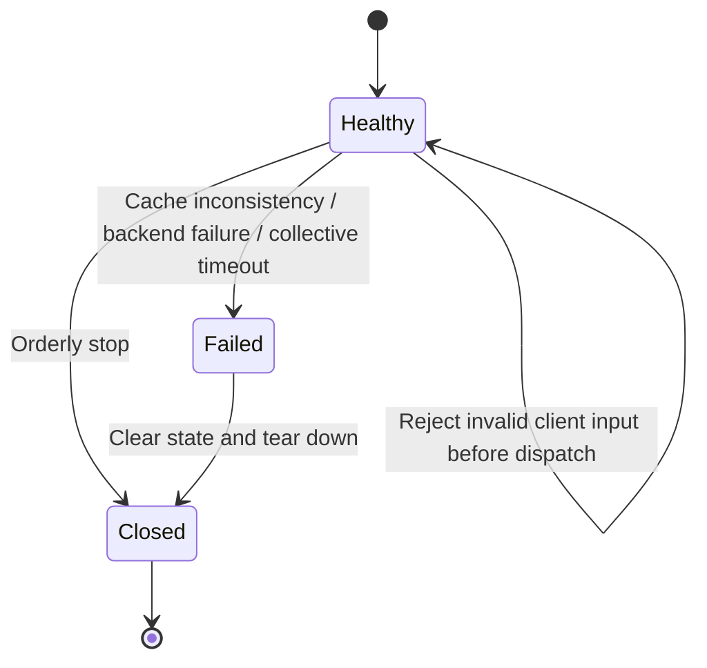
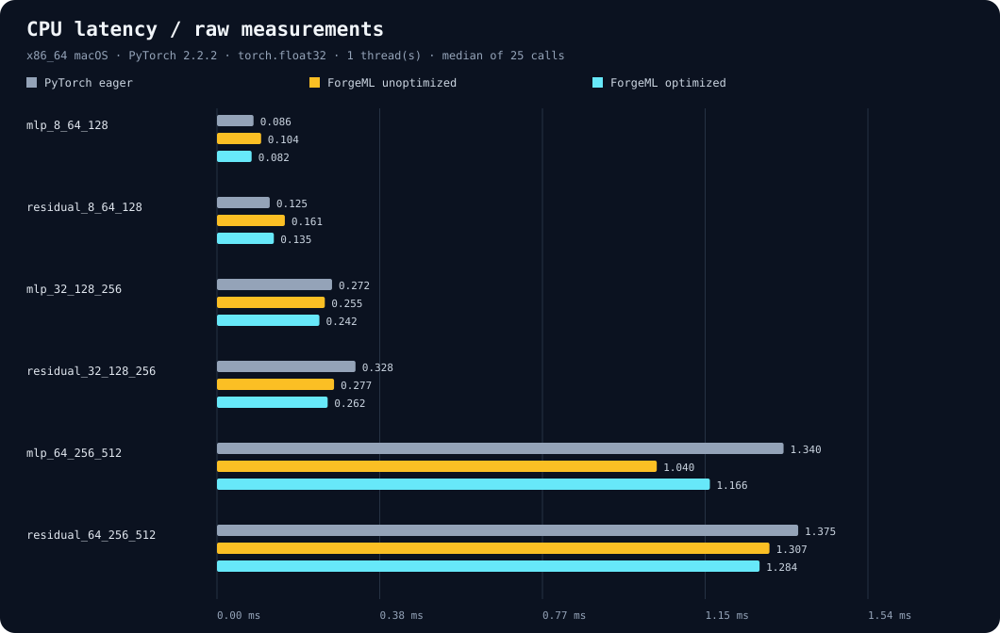
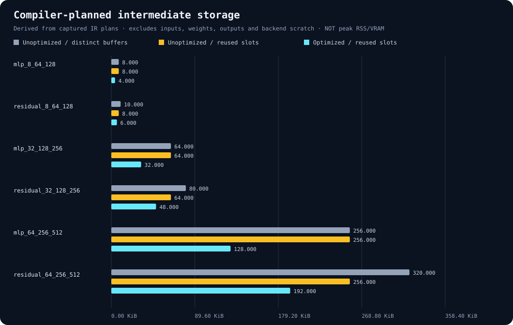
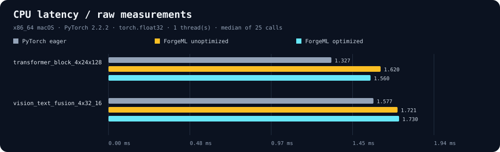
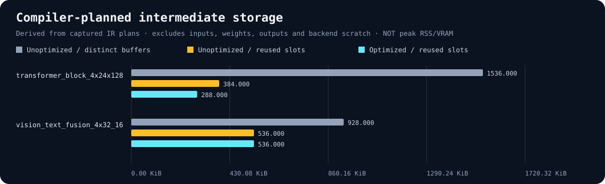

# ForgeML

### A small, inspectable ML inference compiler, plus Nebula, a distributed decoder runtime

[](https://github.com/rayhankhilji/ForgeML/actions/workflows/ci.yml)

**From a PyTorch model to a typed graph, an optimized execution plan, reusable activation slots, and specialized Triton kernels. From one decoder process to tensor- and pipeline-parallel inference.**

ForgeML is an executable systems project, not a wrapper around `torch.compile`. It implements its own graph representation, two frontends, a pass pipeline, a scheduling heuristic, a view-aware memory planner, kernel dispatch, and a correctness-gated tuning loop. Nebula implements the complementary runtime problems: model partitioning, collective communication, autoregressive KV state, request admission, batching, routing, and failure handling. Together they are about 5,100 lines of library code with 177 test functions, and no dependency on TVM, MLIR, TensorRT, Inductor, ONNX Runtime, or a serving framework.

The two packages share a repository and measurement utilities, but they are honest about their boundary: **Nebula is not secretly compiled by ForgeML.** Its attention and distributed execution use PyTorch directly. ForgeML supports a deliberately static transformer and vision subset: LayerNorm, rank-4 scaled dot-product attention, Conv2d, embedding lookup, and the linear, activation, and layout operators around them. It is not a general pretrained-model compiler.

> **Evidence boundary.** Every performance number in this document is a checked-in CPU capture with raw samples, an environment record, and a clean source commit. Modern Linux dependency installation, the correctness suite, and packaging run in GitHub Actions. CUDA/Triton and NCCL code is hardware-gated and has **not** been validated on NVIDIA hardware in this build environment: the GPU tests visibly skip without CUDA and Triton. No GPU speedup, multi-GPU scaling result, production-readiness claim, or comparison with vendor products is implied anywhere below.

## Contents

- [Why this project](#why-this-project)
- [Quick start](#quick-start)
- [Architecture](#architecture)
- [The compile pipeline](#the-compile-pipeline)
- [Operator support](#operator-support)
- [Optimization passes](#optimization-passes)
- [Memory and lifetime model](#memory-and-lifetime-model)
- [Static cost analysis](#static-cost-analysis)
- [Triton lowering and autotuning](#triton-lowering-and-autotuning)
- [Nebula distributed runtime](#nebula-distributed-runtime)
- [Measured results](#measured-results)
- [Benchmarking and profiling](#benchmarking-and-profiling)
- [Free GPU notebook workflow](#free-gpu-notebook-workflow)
- [Limitations](#limitations)
- [Verification](#verification)
- [Roadmap](#roadmap)
- [Reading the code](#reading-the-code)

## Why this project

Most compiler work is invisible inside a large stack. ForgeML keeps every decision small enough to read end to end and instrument directly:

- **A typed SSA-style IR** (`src/forgeml/ir.py`) where every value has one producer, a declared `(shape, dtype, device)` spec, and define-before-use ordering, validated by running each operator on meta tensors.
- **A real pass pipeline** (`src/forgeml/passes.py`): dead-node elimination, bounded constant folding, algebraic simplification, CSE, matmul-to-linear canonicalization, linear+GELU epilogue fusion, and a cost-evaluated scheduler, each re-validating the graph and recording before/after node counts.
- **A view-aware memory planner** (`src/forgeml/memory.py`) that computes live intervals, treats reshape/transpose results as borrowed views, and packs intermediates into reusable slots with a strict non-overlap rule.
- **An explicit executor** (`src/forgeml/compiler.py`) that checks input guards, allocates the slot arena once and reuses it across calls, writes `mm`/`addmm`/`clamp_min` results directly into planned storage, and clones outputs so callers never alias scratch. The persistent arena makes `CompiledModel.__call__` non-reentrant: concurrent calls must synchronize externally.
- **A Triton GEMM template** (`src/forgeml/_triton.py`) with masked loads, strided operands, optional bias and GELU epilogues, IEEE-precision accumulation, and a four-candidate autotuner that gates every candidate on a numerical comparison before timing it.
- **A distributed decoder runtime** (`src/nebula/`): head- and channel-sharded tensor parallelism with SUM all-reduce, contiguous-range pipeline stages, a validated per-rank KV cache, an integer-tensor command protocol, a bounded async batcher, and a least-pending replica router.
- **Measurement as a contract** (`src/forgeml/measurement.py`, `src/forgeml/reporting.py`, `src/nebula/benchmarks.py`): raw samples over smoothed aggregates, git provenance on every capture, correctness gates before timing, and a figure renderer that re-verifies medians, slot capacities, and view aliases against the stored IR before drawing anything.

## Quick start

### Install

The primary development target is **Python 3.12 on Linux**. Python 3.11+ is declared. Use a virtual environment; the package has no hosted service, API key, or model-download requirement.

```bash
git clone https://github.com/rayhankhilji/ForgeML.git
cd ForgeML
python3.12 -m venv .venv
source .venv/bin/activate
python -m pip install -e '.[dev,onnx]'
pytest -q
python examples/compile_mlp.py
```

For NVIDIA execution, use Linux with a compatible NVIDIA driver and CUDA-enabled PyTorch:

```bash
python -m pip install -e '.[dev,onnx,gpu]'
pytest -q -m gpu
```

Core versions are pinned in `pyproject.toml`: PyTorch 2.14.0, NumPy 2.5.3; optional ONNX 1.22.0 and Triton 3.8.0 (Linux x86_64 only). GPU tests skip without CUDA; **a green CPU CI badge does not validate GPU kernels**.

**Intel macOS caveat.** Recent PyTorch releases do not ship Intel macOS wheels. The checked-in CPU measurements were captured with an explicitly separate compatibility environment: PyTorch 2.2.2, NumPy 1.26.4, Python 3.12.14. That old environment is not the recommended installation target; the declared modern stack is independently exercised on Linux CI. Apple GPU/MPS acceleration is not a validated backend.

### Compile a model

```python
import torch
from torch import nn
import forgeml

model = nn.Sequential(
    nn.Linear(64, 128),
    nn.GELU(approximate="tanh"),
    nn.Linear(128, 32),
).eval()

x = torch.randn(8, 64)
compiled = forgeml.compile(model, (x,), backend="auto")
y = compiled(x)
torch.testing.assert_close(y, model(x))

print(compiled.explain())          # passes, memory plan, kernel plan, cost model
print(compiled.graph.to_mermaid()) # renderable graph dump
```

`compile()` specializes to input shape, dtype, and device. Parameters are snapshotted as detached clones, execution runs under `torch.inference_mode`, and returned tensors are cloned so they stay valid across subsequent calls. Changing the source model's weights does not change the compiled snapshot: compile again after a weight update. Training-mode models with active Dropout or BatchNorm are rejected.

```bash
forgeml explain           # JSON: passes, slots, kernel plan, static analysis
forgeml explain --mermaid # graph dump
forgeml kernel-source     # the Triton template
forgeml benchmark --device cpu --output artifacts/compiler.json
```

### Import ONNX

```python
import forgeml

graph = forgeml.from_onnx("model.onnx")
compiled = forgeml.compile(graph)
```

An optional tuple of example tensors can bind symbolic ONNX input dimensions; it cannot override declared fixed dimensions or dtypes. Import does not use ONNX Runtime. External-data tensors and custom operator domains are rejected rather than silently approximated.

### Generate with Nebula

```bash
python examples/nebula_generate.py --tokens 4
python examples/nebula_batching.py
```

For a two-process CPU correctness experiment over Gloo:

```bash
torchrun --standalone --nproc-per-node=2 examples/nebula_generate.py --tp 2 --device cpu
```

For NVIDIA systems with the stated number of allocated GPUs (NCCL):

```bash
torchrun --standalone --nproc-per-node=2 examples/nebula_generate.py --tp 2 --device cuda
torchrun --standalone --nproc-per-node=4 examples/nebula_generate.py --tp 2 --pp 2 --device cuda
torchrun --standalone --nproc-per-node=8 examples/nebula_generate.py --tp 8 --device cuda
```

These are **launch recipes, not claims that 2/4/8-GPU runs have been measured**. Nebula's decoder is initialized deterministically with random weights and emits token IDs to exercise systems behavior; it does not produce meaningful language from a pretrained model.

## Architecture


```mermaid
flowchart TD
    PT[PyTorch nn.Module] --> FX[FX tracing and explicit operator lowering]
    ONNX[ONNX ModelProto] --> OI[Restricted ONNX importer]
    FX --> IR[Typed tensor DAG / use-def validation]
    OI --> IR
    IR --> PASSES[Pass pipeline: DCE, fold, simplify, CSE, canonicalize, fuse]
    PASSES --> SCHED[Cost-evaluated deterministic scheduling]
    SCHED --> MEM[View-aware liveness / reusable slots]
    MEM --> SELECT[Per-node kernel selection]
    SELECT --> TORCH[PyTorch reference executor]
    SELECT --> TRITON[Tiled Triton JIT specialization]
    TRITON --> GPU[CUDA execution]
    TORCH --> CPU[CPU or CUDA execution]
```

| Layer | Implementation | Responsibility |
|---|---|---|
| IR | `src/forgeml/ir.py` | Typed values, validation, cloning, JSON and Mermaid inspection |
| Import | `src/forgeml/frontend.py` | FX and ONNX lowering with explicit semantic checks |
| Rewrites | `src/forgeml/passes.py` | Reachability, constant propagation, pattern fusion, scheduling |
| Storage | `src/forgeml/memory.py` | Live intervals and dtype/device-compatible reusable slots |
| Execution | `src/forgeml/compiler.py` | Input guards, slot allocation, dispatch, output ownership |
| GPU | `src/forgeml/kernels.py`, `_triton.py` | Kernel eligibility, tiled GEMM and fused epilogues |
| Tuning | `src/forgeml/autotune.py` | Correctness-gated candidate timing, per-instance selection |
| Neural workloads | `src/forgeml/neural.py` | Static transformer block and vision/text fusion benchmark models |
| Graph analysis | `src/forgeml/analysis.py` | Operator counts, FLOP/traffic bounds, intensity, critical path |
| Distributed inference | `src/nebula/` | Decoder sharding, command protocol, caches, batching, routing |
| Measurement | `measurement.py`, `reporting.py`, both `benchmarks.py` | Raw samples, provenance, correctness gates, scaling definitions |

Triton performs the GPU machine-code compilation; ForgeML owns the graph-level decisions and the specialized kernel template with its launch parameters. It does not implement a new CUDA assembler.

## The compile pipeline

`forgeml.compile()` runs a fixed, recorded sequence. Every pass returns a new validated `Graph` and appends a `PassRecord(name, nodes_before, nodes_after)` visible in `compiled.explain()["passes"]`:

```text
capture (FX or ONNX)
  -> validate()                       full spec inference on meta tensors
  -> eliminate_dead_nodes             backward reachability from outputs
  -> fold_constants                   pure ops, <= 64 MiB per folded result
  -> eliminate_dead_nodes             remove constants orphaned by folding
  -> simplify_algebra                 identity reshapes, inverse transposes
  -> common_subexpression_elimination alias identical pure computations
  -> canonicalize_linear              matmul + 1-D bias add -> linear
  -> fuse_linear_gelu                 linear/matmul -> gelu -> fused_linear_gelu
  -> fuse_shared_projections          q/k/v-style shared-input linears -> wide linear + narrows
  -> eliminate_dead_nodes             remove producers absorbed by fusion
  -> schedule                         pick the order minimizing planned bytes
  -> plan_memory                      live intervals, view aliases, slot reuse
  -> select_kernels                   per-node torch/triton assignment
```

The result is a `CompiledModel` holding the optimized graph, a clone of the pre-pass graph for delta analysis, the `MemoryPlan`, the pass records, and the per-node kernel plan. Nothing is hidden: `explain()` returns all of it as JSON-serializable data with no tensor values.

## Operator support

The operator set is explicit and bounded. Each op has a fixed arity, a whitelist of attributes, and spec inference that rejects invalid ranks, dtypes, devices, and attribute combinations before execution.

| IR op | Arity | Semantics and restrictions |
|---|---|---|
| `matmul` | 2 | Rank-2 operands only, matching dtype and inner dimension |
| `linear` | 2-3 | `x @ W` with `W` stored transposed, optional 1-D bias of output width |
| `add`, `mul` | 2 | Broadcasting; scalar operands allowed; no in-place or `out=` import |
| `relu` | 1 | Non-in-place only |
| `gelu` | 1 | `approximate` in `{"none", "tanh"}` |
| `fused_linear_gelu` | 2-3 | Epilogue-fused affine projection plus GELU; produced only by the fusion pass |
| `reshape` | 1 | Static positive dims, numel-preserving; planned as a borrowed view |
| `transpose` | 1 | Explicit `dim0`/`dim1` swap; `t()` restricted to rank 2; planned as a borrowed view |
| `narrow` | 1 | Static `[start, start+length)` slice on one dim; produced only by the shared-projection pass; planned as a borrowed view |
| `softmax` | 1 | Explicit static axis; dtype override rejected |
| `layer_norm` | 1 or 3 | Static trailing `normalized_shape`; paired affine tensors or none; finite positive `eps` |
| `sdpa` | 3-4 | Rank-4 `[batch, heads, seq, head_dim]`; equal K/V shapes; inference-only; `is_causal` flag and optional finite positive `scale`; optional `attn_mask` broadcastable to `[B, H, Q, K]` (bool or query dtype, mutually exclusive with `is_causal`); no dropout or GQA |
| `conv2d` | 2-3 | NCHW input, OIHW weight, optional 1-D bias; positive stride/dilation, non-negative padding, valid groups; zero padding only |
| `embedding` | 2 | Int64 indices into a rank-2 `[vocab, dim]` table; padding_idx/max_norm/sparse module options rejected |

Frontends additionally accept literal `torch.arange`, tensor `shape`/`ndim`/`device`/`dtype` reads, and static integer arithmetic so compile-time layout resolves to constants. Outputs are one tensor or a flat tensor tuple.

### ONNX subset

Default domain only, opsets 13-22, single-output nodes, no external data, no custom domains:

`MatMul`, `Add`, `Mul`, `Relu`, `Gelu` (opset 20+, `approximate` in `{none, tanh}`), `Reshape` (constant int64 shape, `allowzero=0`, zeros copy input dims, at most one `-1`), `Transpose` (identity or a single dimension swap), `Softmax`, `Constant`, `Identity`, `Gemm` (full `alpha`/`beta`/`transA`/`transB` lowering; emits `linear` directly for `alpha=1`, `beta=1`, rank-1 `C`), `Conv` (rank-2 spatial params, `NOTSET` auto_pad, symmetric pads), `LayerNormalization` (`stash_type=1`, axis-resolved trailing shape, zero bias synthesized when omitted), `Gather` (axis 0 only, imported as `embedding`).

Anything outside this subset fails with an explicit `UnsupportedOperator` instead of an opaque fallback.

### Deliberately not supported

Training and gradients through compiled execution, dynamic control flow, general dynamic shapes, nonzero-padding Conv2d modes, attention dropout and GQA/MQA, sparse or normalizing embedding variants, arbitrary Python side effects, nested output structures, arbitrary ONNX domains, and pretrained-model loading. FX tracing executes Python from the supplied module: compile only trusted models.

## Optimization passes

### Dead-node elimination and bounded constant folding

Backward reachability from the observable outputs runs in $O(|V| + |E|)$ for a graph $G = (V, E)$ and discards unreachable operators and constants while preserving the public input signature. Constant folding evaluates a node only when every operand is a known constant, and only when the predicted result fits a **64 MiB per-result budget checked before allocation**. That is a per-result bound, not a total compiler-memory sandbox. Tensor evaluation and snapshot copying scale with actual operation and byte counts; this is intentionally not a zero-copy frontend.

### Algebraic simplification and CSE

`simplify_algebra` removes identity reshapes and adjacent transposes over the same dimension pair, then re-runs DCE so aliased-away producers disappear. `common_subexpression_elimination` hashes `(op, resolved inputs, frozen attrs, output spec)` and aliases a duplicate pure computation to its first producer. These are conservative local rewrites, not symbolic algebra, layout propagation, or a proof engine.

### Linear canonicalization and epilogue fusion

`linear` is a first-class affine projection, not a temporary `matmul` followed by a vector `add`. `canonicalize_linear` rewrites an eligible `matmul + 1-D bias add` pair into `linear` when the matmul has exactly one consumer and is not a graph output, so ONNX-shaped graphs get the same representation as `nn.Linear` lowering. `fuse_linear_gelu` then recognizes

$$Y = \operatorname{GELU}(XW + b), \qquad X \in \mathbb{R}^{M \times K},\quad W \in \mathbb{R}^{K \times N},\quad b \in \mathbb{R}^{N} \text{ or absent},$$

for the `linear -> gelu`, `matmul -> gelu`, and `matmul -> add -> gelu` shapes. A producer is fused only when it has exactly one consumer and is not itself observable; a shared projection, an observable pre-activation, or a non-vector legacy bias blocks the transform. The terminal node's name, spec, optional bias, and GELU mode are preserved.

### Shared-projection fusion

`fuse_shared_projections` targets the classic attention pattern where several `linear` nodes read the same activation: $Q = XW_q$, $K = XW_k$, $V = XW_v$. Two or more same-arity `linear` nodes with identical inputs and constant weights are replaced by one wide projection

$$X\,[W_q \; W_k \; W_v] \in \mathbb{R}^{M \times (N_q + N_k + N_v)},$$

followed by static `narrow` views that slice each member's columns. The wide weight and concatenated bias are materialized once at compile time; each `narrow` is a borrowed view, so no copy materializes the slices. The rewrite trades a longer-lived wide buffer for fewer launches. The pass requires constant weights (and constant biases when present) and is skipped whenever the pattern does not apply.


```mermaid
flowchart LR
    subgraph Before
        X1[X] --> L[Linear]
        W1[Wt] --> L
        B1[bias?] --> L
        L --> G[GELU]
    end
    subgraph After
        X2[X] --> F[fused_linear_gelu]
        W2[Wt] --> F
        B2[bias?] --> F
    end
```

**This is graph fusion, not hardware kernel fusion.** On the Torch backend the fused op dispatches through `torch.mm`/`torch.addmm` plus `F.gelu` into planned storage: fewer nodes and fewer intermediates, still separate kernels. Only on the Triton path do the tile accumulator, bias add, and activation share one kernel invocation.

### Cost-model-guided scheduling

`schedule` enumerates six deterministic ready-list policies built from

$$\operatorname{score}(v) = \operatorname{bytesFreedByLastUses}(v) - \operatorname{bytesProduced}(v),$$

plus variants that double or halve the production-cost weight, minimize produced bytes before counting freed bytes, and follow forward or reverse program order. Every candidate is a valid topological order; ForgeML runs the same view-aware memory planner used by execution on each and keeps the order with the lowest `planned_bytes`, breaking ties by node-name order. Only intermediate values whose remaining consumer count reaches zero count as freed; inputs, constants, and observable outputs are never counted as released storage.

This is bounded local search, not an optimal register allocator, modulo scheduler, or stream scheduler. Candidate enumeration can be quadratic or worse on very large graphs, acceptable for the miniature workloads targeted here but something to bound before production-scale IR.

## Memory and lifetime model

A materialized intermediate $v$ gets a closed live interval

$$I_v = [\operatorname{produce}(v),\ \operatorname{lastUse}(v)].$$

`reshape`, `transpose`, and `narrow` nodes are planned as **borrowed views**, not fresh buffers. When a producer feeds a view, its physical last use is extended recursively to the view's last materialized consumer; otherwise a later node could overwrite storage the view still reads. This removes layout-copy intermediates from attention-style reshape/transpose chains while keeping a conservative interval on the underlying producer. A view changes operand strides, so it removes a copy but does not guarantee a downstream kernel gets faster.

A retired slot can be reassigned only when

$$\operatorname{lastUse}(u) < \operatorname{produce}(v),$$

with matching dtype and device and sufficient capacity. The **strict inequality** prevents an operator from overwriting one of its own live operands. Best-fit search picks the smallest compatible retired slot; slots are flat 1-D arenas viewed at each node's shape.


```mermaid
flowchart LR
    A[a produced] --> B[b consumes a]
    B --> C[c produced after a dies]
    S0[Slot 0: a then c] -. reuse .-> C
    S1[Slot 1: b stays live] -. preserve .-> B
```

`MemoryPlan.naive_bytes` sums the distinct **internal intermediate** buffers over every non-output node; `planned_bytes` sums the capacities of the persistent slot arena, which covers only ops with an `out=` write path (`matmul`, `linear`, `add`, `mul`, `relu`, `softmax`, `gelu`, `embedding`, `fused_linear_gelu`). Neither figure includes inputs, constants, graph outputs, refcounted temporaries from ops without `out=` variants (`layer_norm`, `conv2d`, `sdpa`), PyTorch allocator scratch, CUDA fragmentation, or the compiler's weight snapshots. **These are plan statistics, not measured peak RSS or VRAM**, and they are labeled that way in every report and figure.

Execution allocates the slot arena once per compiled model and reuses it across calls, which makes `__call__` non-reentrant. It writes `matmul`/`linear`/`add`/`mul`/`relu` results directly into slot views (`relu` through `clamp_min(x, 0)`), computes view-like ops as views, and evaluates every other node into a fresh tensor whose lifetime is managed by refcounting. Observable outputs are produced into fresh storage (view outputs are cloned at production), and dead intermediates are dropped from the value map as their consumer counts hit zero. The contract trades some copying for simple, explicit ownership: returned tensors never borrow mutable scratch.

## Static cost analysis

`compiled.explain()["analysis"]` is a transparent cost model, not hardware counters. Per node it reports op kind, output shape, modeled FLOPs, unique input bytes plus output bytes, arithmetic intensity, and producer-consumer depth; the summary adds operator counts, input/constant/output bytes, critical-path depth, and the five largest modeled contributors.

For an $M \times K$ by $K \times N$ product the model charges $2MKN$ FLOPs; `linear` adds one FLOP per output element for the bias, and `fused_linear_gelu` adds the same plus eight ops per output for the activation approximation. NCHW convolution charges two FLOPs per output multiply-accumulate plus one per bias-add element. Attention is charged

$$2BHQK\,(2d_h) + 5BHQK$$

over all $B \cdot H \cdot Q \cdot K$ key-query pairs, replaced by the triangular causal count $\min(BHQK,\ BH \cdot Q(Q{+}1)/2)$ when `is_causal` is set. Elementwise and normalization ops carry small fixed estimates. These are roofline-style accounting bounds; they do not model caches, vectorization, occupancy, fusion effects, Python overhead, or allocator behavior.

`optimization_delta` diffs the optimized graph against the pre-pass graph on nodes, modeled FLOPs, modeled logical traffic, critical-path depth, and planned intermediate bytes, so a real graph-size or traffic reduction is distinguishable from a latency change caused by a different layout or schedule.

## Triton lowering and autotuning

### Tiled matrix multiplication

A program instance computes a $B_M \times B_N$ output tile, accumulating over $K$-chunks of size $B_K$:

$$C_{ij} = \sum_{r=0}^{\lceil K / B_K \rceil - 1} A_{i,r}\, B_{r,j}.$$

The template handles ragged edges with masked loads and stores, takes explicit operand strides plus a strided bias vector, accumulates in FP32 with `input_precision="ieee"` (TF32 is not silently enabled), and applies an optional fused GELU epilogue as

$$\operatorname{GELU}(x) = \tfrac{1}{2} x \left(1 + \operatorname{erf}\!\left(x / \sqrt{2}\right)\right)
\quad\text{or}\quad
\operatorname{GELU}_{\tanh}(x) = \tfrac{1}{2} x \left[1 + \tanh\!\left(\sqrt{2/\pi}\,(x + 0.044715 x^3)\right)\right].$$

For low-precision inputs the kernel deliberately rounds the matmul and bias-add intermediates back to the source dtype before the activation, preserving the unfused numerical contract rather than silently improving accuracy. BF16 requires compute capability 8.0+. Eligibility, dtype support, and the `out`-buffer storage-overlap check are enforced in `src/forgeml/kernels.py`.

### Kernel selection

| Backend | Behavior |
|---|---|
| `torch` | Every node uses the reference executor |
| `auto` | Eligible CUDA `matmul`/`linear`/`fused_linear_gelu` nodes use Triton when CUDA + Triton are present; everything else uses Torch |
| `triton` | Requires CUDA and the Triton package plus CUDA graph inputs; explicit mixed plan over the supported subset |

The per-node assignment is visible in `compiled.explain()["kernel_plan"]`. A selected Triton launch that fails raises; there is no silent fallback that would manufacture a successful GPU benchmark.

### Autotuning

```python
model = model.cuda()
x = x.cuda()
compiled = forgeml.compile(model, (x,), backend="triton")
report = compiled.autotune(x, warmup=3, repeats=10)
y = compiled(x)
```

Four bounded tile/warp/stage candidates are tried per eligible node. Each candidate must pass a finite-output and numerical comparison gate before it is timed; warmups are excluded, candidate order rotates between repetitions, and the lowest measured median wins. The report returns raw candidate timings, winning configs, and rejected comparisons.

Selections live **only on that compiled model instance**: no persistent, cross-device tuning cache whose stale key could be confused with evidence from another GPU. Compilation and resource failures surface as errors rather than fictitious infinite-latency samples. The tuner is intentionally small; it is not a Bayesian search, an exhaustive autotuner, or a guarantee of beating cuBLAS.

## Nebula distributed runtime

### Model and execution contract

Nebula runs a deterministic pre-normalized causal decoder (`TinyDecoder`, seeded weight init):

$$x_0 = E_{\mathrm{token}}(t) + E_{\mathrm{position}}(p),$$
$$u_l = x_l + \operatorname{Attention}(\operatorname{LN}(x_l)),$$
$$x_{l+1} = u_l + W_{\mathrm{down}}\, \operatorname{GELU}_{\tanh}\!\left(W_{\mathrm{up}}\, \operatorname{LN}(u_l)\right).$$

Separate Q/K/V projections, learned positional embeddings, a final LayerNorm, and an untied vocabulary projection keep the computation inspectable. Generation is greedy, fixed-length, and returns **new token IDs only**. No pretrained quality, tokenizer compatibility, or sampling quality is claimed or measured.

### Tensor and pipeline parallelism


```mermaid
flowchart LR
    IN[Leader: commands and token IDs] --> S0A
    IN --> S0B
    subgraph Stage0[Pipeline stage 0]
        S0A[TP lane 0 / local heads and FF channels]
        S0B[TP lane 1 / local heads and FF channels]
        S0A <-->|SUM all-reduce| S0B
    end
    subgraph Stage1[Pipeline stage 1]
        S1A[TP lane 0 / later layers]
        S1B[TP lane 1 / later layers]
        S1A <-->|SUM all-reduce| S1B
    end
    S0A -->|activation send/recv| S1A
    S0B -->|activation send/recv| S1B
    S1A --> OUT[Final logits broadcast]
    S1B --> OUT
```

With tensor-parallel degree $T$, Q/K/V output rows are sharded by attention head and the output-projection input columns are sharded to match; feed-forward expansion channels split the same way. Each rank computes a partial projection and a SUM all-reduce over the TP group reconstructs the residual-width result:

$$Y = \sum_{r=0}^{T-1} X_r W_r.$$

Each decoder layer performs one TP reduction after attention and one after the feed-forward projection. LayerNorm parameters and residual streams are replicated inside a TP group. With pipeline degree $P$, contiguous layer ranges map to stages:

$$\mathrm{tpRank} = \mathrm{rank} \bmod T, \qquad \mathrm{ppRank} = \lfloor \mathrm{rank} / T \rfloor, \qquad \mathrm{worldSize} = T \times P.$$

Layer count must divide by $P$; heads, hidden size, and feed-forward width must divide by $T$. CPU collectives use Gloo, CUDA collectives use NCCL, and logits are broadcast from the last stage. Weight init builds the deterministic full CPU reference model, clones the owned shards, and drops the reference: persistent device weights are sharded, but the loader does not suit models exceeding one host's memory.

**Pipeline limitation.** Stages use blocking `dist.send`/`dist.recv`, one forward traversal at a time, with no microbatch overlap; every TP lane transfers its replicated activation. This is real partitioned execution, not a throughput-optimized pipeline.

### KV-cache coordination

Each rank owns only its local layers' and local heads' keys and values in contiguous per-request buffers. The leader coordinates request IDs and positions; `append` validates layer ownership, ID uniqueness, capacity, shape `[B, heads_local, T, head_dim]`, dtype, device, and the expected position, including cross-layer length consistency. A decode query at absolute position $p$ attends only to keys with $k \le p$; treating a cached decode as a fresh causal sequence would produce the wrong mask, so masks are built from absolute positions.

For batch $B$, reserved capacity $S$, $L$ layers, $h$ heads, head dimension $d_h$, and element size $w$, the planned cache footprint per rank is

$$M_{\mathrm{KV,rank}} = 2\,\frac{L}{P}\, B S\, \frac{h}{T}\, d_h\, w,$$

where the factor two counts K and V. This is **not paged attention**, prefix sharing, cache migration, or cross-replica coherence. Releasing a request drops its local state on every participating rank.

### Leader/worker protocol and failure semantics

Rank zero is the only command authority. It broadcasts fixed-size int64 headers (`STEP`, `RELEASE`, `STOP`) followed by request-ID and token payloads on CPU or NCCL tensors; worker ranks run `Engine.serve()`. The protocol never serializes Python objects through pickle-based collectives.


```mermaid
stateDiagram-v2
    [*] --> Healthy
    Healthy --> Healthy: Valid prefill / decode / release
    Healthy --> Healthy: Reject invalid client input before dispatch
    Healthy --> Failed: Cache inconsistency / backend failure / collective timeout
    Healthy --> Closed: Orderly stop
    Failed --> Closed: Clear state and tear down
    Closed --> [*]
```

A rank failure or partial cache mutation cannot be safely recovered by rerunning the same token, so the engine goes unhealthy, clears state, and fails subsequent calls. Cache preflight is agreed across ranks with a MAX all-reduce before dispatch. Process-group timeouts bound communication waits and `torchrun` supervises worker processes. There is no elastic membership, checkpoint restore, exactly-once execution, or transparent in-flight replay. Run it on trusted networks: tensor-only messages avoid unpickling, but this is not an authenticated or encrypted service.

### Batching and request routing

`AsyncBatcher` admits a bounded number of outstanding requests (queued plus in-flight), groups compatible requests within a short batching window (dispatched immediately once a full batch is ready), and serializes engine calls off the event loop. Compatibility means equal prompt length and equal requested output length; unlike padded batching, this needs no attention mask the engine does not implement. Cancellation and client timeouts retire futures, but cancelling a future cannot cancel a GPU kernel or roll back distributed cache mutation: started work finishes or fails through the engine's failure boundary.

`RequestRouter` picks the healthy replica with the fewest pending requests, round-robin on ties, and falls through to the next replica only on `QueueFull` for unstarted work. A backend failure never triggers a silent retry of partially executed requests. This is dynamic **request microbatching**, not continuous token-level batching, an HTTP gateway, authentication, replica provisioning, or a multi-node control plane; the example router runs in-process over independent engines.

## Measured results

Everything below is checked in under [`benchmarks/results/`](benchmarks/results/) and [`artifacts/`](artifacts/) with raw sample arrays, environment records, and clean-commit provenance. These are development-host captures, not controlled hardware comparisons.

### Compiler suite: MLP and residual MLPs

- **Source:** clean commit `92f3dfddd63e1d5d80b32d7d1f1d87397f9e6cf7`, captured 2026-09-28.
- **Host:** x86_64 macOS 26.6.2, Python 3.12.14, PyTorch 2.2.2, CPU FP32, one Torch thread.
- **Method:** 5 warmups then 25 measured calls per variant, rotating variant order, synchronized host wall clock, whole invocation including Python dispatch and output ownership; compilation and tuning excluded.
- **Gate:** all six workloads passed eager-output comparison before timing. Raw p95 values show substantial tail variability; no confidence interval or repeat-run stability is claimed.



| Workload `batch_width_hidden` | Eager median ms | Unoptimized median ms | Optimized median ms | Optimized p95 ms | Eager / optimized |
|---|---:|---:|---:|---:|---:|
| `mlp_8_64_128` | 0.086 | 0.104 | 0.082 | 0.463 | 1.055x |
| `residual_8_64_128` | 0.125 | 0.161 | 0.135 | 0.294 | 0.927x |
| `mlp_32_128_256` | 0.272 | 0.255 | 0.242 | 1.057 | 1.123x |
| `residual_32_128_256` | 0.328 | 0.277 | 0.262 | 0.744 | 1.251x |
| `mlp_64_256_512` | 1.340 | 1.040 | 1.166 | 3.503 | 1.149x |
| `residual_64_256_512` | 1.375 | 1.307 | 1.284 | 2.081 | 1.071x |

A ratio below one is a **slowdown**. Five of six workloads now run faster than eager on this host, helped by the persistent slot arena and direct `out=` writes; the smallest residual MLP is still slower because per-call interpreter overhead dominates at that size. Medians drift noticeably between captures on this machine, so treat every ratio as noisy evidence rather than a portable speedup guarantee.



The memory chart is reconstructed from captured IR and slot plans, not from an RSS/VRAM sensor:

| Workload | Naive buffers KiB | Unoptimized slots KiB | Optimized slots KiB | Nodes before -> after |
|---|---:|---:|---:|---:|
| `mlp_8_64_128` | 8 | 4 | 0 | 3 -> 2 |
| `residual_8_64_128` | 10 | 4 | 2 | 4 -> 3 |
| `mlp_32_128_256` | 64 | 32 | 0 | 3 -> 2 |
| `residual_32_128_256` | 80 | 32 | 16 | 4 -> 3 |
| `mlp_64_256_512` | 256 | 128 | 0 | 3 -> 2 |
| `residual_64_256_512` | 320 | 128 | 64 | 4 -> 3 |

Fusion removes one node per graph. The arena covers only `out=`-capable intermediates: on the plain MLPs it drops to zero because the single internal `fused_linear_gelu` result is a refcounted temporary, while the residual variants keep one `add` result slotted. `naive_bytes` still counts every internal intermediate, slotted or not.

### Neural suite: transformer block and vision/text fusion

- **Source:** clean commit `92f3dfddd63e1d5d80b32d7d1f1d87397f9e6cf7`, captured 2026-09-28.
- **Host:** the same x86_64 macOS / Python 3.12.14 / PyTorch 2.2.2 / CPU FP32 / one-thread environment.
- **Transformer:** batch 4, sequence 24, hidden 128, 8 heads, causal SDPA, 256-wide tanh-GELU feed-forward.
- **Vision/text:** batch 4, 3x32x32 images, 16 int64 tokens, a 16-channel Conv2d path, LayerNorm text path, additive fusion, GELU class head.



| Workload | Eager median ms | Unoptimized median ms | Optimized median ms | Optimized p95 ms | Eager / optimized |
|---|---:|---:|---:|---:|---:|
| `transformer_block_4x24x128` | 2.300 | 2.798 | 2.584 | 6.667 | 0.890x |
| `vision_text_fusion_4x32_16` | 2.590 | 2.430 | 2.699 | 4.361 | 0.960x |

The optimized interpreter lands just below eager parity on this noisy host in this capture, and the optimized medians beat the unoptimized graph on the transformer. The structural evidence is stronger than the timing: `fuse_shared_projections` collapses the three QKV projections into one wide `linear` plus three borrowed `narrow` views, planned arena storage drops from 240 KiB to 192 KiB, modeled logical traffic falls by 288 KiB now that view nodes charge zero bytes, and all four attention transposes plan as borrowed views. The fusion workload goes from 16 to 15 nodes and drops 32 KiB of modeled traffic while keeping the same 33 KiB planned storage.

| Workload | Optimized operators | Modeled MFLOPs | Logical KiB | Arithmetic intensity | Critical path |
|---|---|---:|---:|---:|---:|
| `transformer_block_4x24x128` | 3 linear, 3 narrow, 1 fused linear+GELU, 2 layer_norm, 1 sdpa, 2 add, 8 reshape, 4 transpose | 26.283 | 1765.5 | 14.538 | 18 |
| `vision_text_fusion_4x32_16` | 3 linear, 1 fused linear+GELU, 1 conv2d, 1 embedding, 1 layer_norm, 1 gelu, 1 add, 6 reshape | 13.444 | 5362.3 | 2.448 | 10 |



The transformer's p95 tail is large relative to its median; that is kept in the raw data rather than smoothed away. These are one-thread CPU interpreter timings, not kernel-level measurements and not evidence of GPU behavior.

### Nebula runtime audit

A single-rank CPU smoke capture at clean commit `41d673834103a566eb665404c37b1f59e63d9bad` (2026-09-27, same compatibility environment): a deliberately tiny decoder (hidden 32, 4 heads, 2 layers, feed-forward 64, vocab 256), batch 2, prompt 4, 3 new tokens, warmup 1, repeats 3. Prefill and decode logits matched the monolithic reference within FP32 tolerances (decode max abs error 3.58e-7) and the greedy continuation matched exactly.

| Metric | Median | p95 | Samples |
|---|---:|---:|---:|
| Generation (leader wall clock, 6 output tokens) | 4.918 ms | 5.948 ms | 3 |
| Prefill forward | 2.257 ms | 3.460 ms | 3 |
| Decode step | 1.483 ms | 2.241 ms | 6 |

Planned KV capacity was 131,072 bytes per rank, and generation throughput was about 1,220 output tokens/s. With three samples this is a correctness-and-instrumentation audit, **not a latency claim and not a scaling result**. A single-rank CPU profiler trace with `nebula::attention`, `nebula::kv_append`, and `nebula::feed_forward` regions is checked in at [`artifacts/trace-audit/rank-0.json`](artifacts/trace-audit/rank-0.json).

### Provenance and honesty notes

- Reports embed `git_commit`, `git_dirty`, Python/PyTorch versions, thread counts, device, and capture timestamps; summaries are SHA-256-linked to their raw reports.
- The renderer rechecks stored medians, sample counts, storage totals, slot capacities, view aliases, and lifetime overlap before drawing. It reads the captured report; it does not rerun the workload to make a nicer chart.
- **No measured GPU or 2/4/8-GPU scaling figures are published.** CUDA/Triton/NCCL paths are hardware-gated and unvalidated on this host. The illustrative scaling values in the original project idea are not experimental results.
- `planned_bytes` and `M_KV` are plan statistics and analytical capacities, never allocator peaks.

## Benchmarking and profiling

### Compiler

```bash
forgeml benchmark --suite mlp --device cpu --backend torch --warmup 5 --repeats 25 --threads 1 --output artifacts/compiler-cpu.json
forgeml benchmark --suite neural --device cpu --backend torch --warmup 5 --repeats 25 --threads 1 --output artifacts/neural-cpu.json
forgeml benchmark --suite neural --device cuda --backend triton --dtype float16 --autotune --warmup 10 --repeats 100 --output artifacts/neural-gpu.json
python -m forgeml.reporting artifacts/neural-cpu.json --output-dir artifacts/figures
```

The `mlp` suite compares eager, unoptimized IR, and optimized IR on three MLP and three residual-MLP shapes. The `neural` suite runs the static transformer block and the convolution+embedding fusion model. Both reports carry raw sample arrays, median and linearly interpolated p95, compilation cost, correctness errors, kernel plans, static analysis, and logical storage statistics. Autotuning is excluded from steady-state timings and reported separately.

Numerical gates use `(rtol, atol)` of `(1e-4, 1e-4)` for FP32, `(1e-2, 1e-2)` for FP16, `(5e-2, 5e-2)` for BF16, and `(1e-7, 1e-8)` for FP64; non-finite outputs always fail. These are small-workload validation tolerances, not formal floating-point error bounds.

### Nebula strong scaling

Use the same model, total batch, prompt length, generated-token count, precision, source commit, and hardware class for every point:

```bash
python -m nebula.benchmarks benchmark --device cuda --output artifacts/nebula-1.json
torchrun --standalone --nproc-per-node=2 -m nebula.benchmarks benchmark --device cuda --tp 2 --output artifacts/nebula-2.json
torchrun --standalone --nproc-per-node=4 -m nebula.benchmarks benchmark --device cuda --tp 4 --output artifacts/nebula-4.json
torchrun --standalone --nproc-per-node=8 -m nebula.benchmarks benchmark --device cuda --tp 8 --output artifacts/nebula-8.json
python -m nebula.benchmarks compare artifacts/nebula-1.json artifacts/nebula-2.json artifacts/nebula-4.json artifacts/nebula-8.json --output artifacts/scaling.json
```

Run from a clean recorded commit. `compare` rejects unmatched model/workload/runtime/hardware signatures, failed correctness gates, duplicate topologies, missing baselines, dirty-source captures, and stored medians that disagree with their raw samples. A human still has to ensure the physical hardware and interference conditions are comparable; metadata cannot prove that.

For fixed work, the report defines

$$S_p = \frac{T_1}{T_p}, \qquad E_p = \frac{S_p}{p}, \qquad Q_p = \frac{B N_{\mathrm{new}}}{T_p},$$

speedup, parallel efficiency, and generated-token throughput. The benchmark measures leader-observed generation latency plus separate prefill and decode-step timings, checks prefill and decode logits against a monolithic reference, and verifies the complete greedy continuation before collecting samples.

**CPU multiprocess runs validate distributed semantics; they do not measure GPU scaling.** On small decoders, communication and Python overhead can make extra ranks substantially slower.

### Why scaling is not linear

A useful decomposition is

$$T_p \approx T_{\mathrm{compute}}/p + T_{\mathrm{communication}} + T_{\mathrm{synchronization}} + T_{\mathrm{scheduling}} + T_{\mathrm{serial}}.$$

For a ring all-reduce of $n$ bytes across $T$ ranks, a simplified latency/bandwidth model is

$$T_{\mathrm{allreduce}} \approx 2(T-1)\,\alpha + 2\,\frac{T-1}{T}\, n\,\beta,$$

with $\alpha$ per-step latency and $\beta$ seconds per byte. This is an explanatory model, not a claim that a given NCCL run picks a ring algorithm. Decode often lacks the work per token to amortize two TP collectives per layer; KV traffic grows with context; stage imbalance and blocking PP transfers add idle time; replicated logits and command broadcasts add communication. Faster kernels can even expose a larger *fraction* of communication overhead.

Collect a separate trace rather than mixing profiler overhead into timing samples:

```bash
python -m nebula.benchmarks profile --device cpu --output artifacts/trace
torchrun --standalone --nproc-per-node=2 -m nebula.benchmarks profile --device cuda --tp 2 --output artifacts/trace-gpu
```

Each rank writes a Chrome trace. Inspect attention, feed-forward, KV appends, TP reductions, PP sends/receives, allocations, and synchronization. Regions overlap and include waiting: do not sum region durations and call it end-to-end latency.

## Free GPU notebook workflow

**Kaggle is the practical first place to check** for a free session that may expose two T4 GPUs. Allocation, quotas, verification requirements, and available accelerators are account-dependent: inspect the notebook's accelerator selector and remaining quota. A generous free allocation is not a capacity guarantee and does not provide a reproducible 4/8-GPU cluster.

1. Create a notebook on your own account, enable internet if permitted, and select an eligible NVIDIA accelerator. For two-GPU experiments, verify the session actually exposes two devices.
2. Clone this repository in the notebook. Inspect `nvidia-smi`, `torch.__version__`, `torch.version.cuda`, `torch.cuda.device_count()`, and the installed Triton version before changing anything.
3. Prefer the notebook's working CUDA/PyTorch pairing over blindly upgrading its driver-sensitive stack. For an explicit compatibility experiment, install with `python -m pip install --no-deps -e .` and add missing test tools. That preserves provider packages but is **not the pinned reference environment**; run the correctness tests and record the actual versions.
4. Run `pytest -q -m gpu`. A skipped GPU suite is not validation. T4-class hardware does not support the BF16 kernel path; use FP16 or FP32.
5. Run the compiler CUDA benchmark. On a verified two-GPU session whose rules permit it, use the two-rank Nebula recipe and save raw JSON plus per-rank profiler traces.
6. Download artifacts before the ephemeral session ends. Never commit provider credentials, tokens, or private data.

[Colab's official FAQ](https://research.google.com/colaboratory/intl/en-GB/faq.html) states free GPU resources are not guaranteed and restricts distributed computing workers on the free tier. Use it, if available, for permitted interactive single-GPU compiler experiments, not as a workaround for a free distributed cluster. This repository does not create accounts, bypass quotas, or provision paid resources.

## Limitations

| Area | Implemented scope | Not claimed |
|---|---|---|
| Compiler | Static typed DAG and bounded neural operator set | General PyTorch compatibility, dynamic graphs, a mature optimizing compiler |
| Attention/vision | Rank-4 inference SDPA with optional broadcast mask, NCHW Conv2d, int64 embedding lookup | Dropout attention, GQA/MQA, nonzero padding modes, paged/flash attention, pretrained checkpoints |
| GPU codegen | Tiled GEMM / fused bias-GELU Triton template | Handwritten CUDA, arbitrary graph-to-one-kernel fusion, cuBLAS superiority; GPU path is hardware-gated and unvalidated here |
| Memory | View-aware per-call intermediate-slot reuse | Whole-process peak-memory reduction or zero allocation; `planned_bytes` is not allocator peak |
| Graph analysis | Static FLOP/traffic/intensity/critical-path accounting | Measured hardware counters or roofline predictions |
| Autotuning | Four correctness-gated candidates per compiled instance | Global optimality or a portable persisted tuning database |
| Model | Small deterministic decoder plus static compiler workloads | Pretrained LLM/multimodal quality or checkpoint loading |
| Parallelism | TP collectives and blocking PP partitioning | Overlapped pipeline throughput, elastic resizing, automatic placement |
| KV cache | Per-request, per-rank contiguous storage | Paged attention, prefix caching, cache transfer, speculative decoding |
| Serving | Bounded in-process batching and replica selection | Public HTTP service, authentication, multi-tenant isolation, continuous batching |
| Failure handling | Explicit failure, cleanup, bounded communication waits | Transparent recovery of partially executed requests |
| Results | Raw CPU compiler captures and reproducible GPU commands | Invented GPU timing or unmeasured scaling efficiency |

## Verification

```bash
ruff check src tests examples
ruff format --check src tests examples
pytest -q                    # full CPU suite; GPU tests skip without CUDA+triton
pytest -q -m distributed     # gloo multiprocess distributed correctness
pytest -q -m gpu             # CUDA + triton only
python -m build              # sdist/wheel
python examples/compile_mlp.py
python examples/nebula_generate.py --tokens 2
python examples/nebula_batching.py
```

The suite covers IR rejection paths, FX/ONNX lowering, exact and approximate activation semantics, parameter snapshots, fusion boundaries, constant-fold budgets, scheduling invariants, lifetime reuse and view extension, output aliasing, kernel selection, measurement definitions, KV-cache invariants, decoder parity, batching and routing, and distributed process topologies. Hardware-gated checks remain visibly skipped without their required hardware.

## Roadmap

Natural next steps, each to land with an executable contract and a regression test before any performance claim:

1. Symbolic shape constraints and bounded dynamic shapes.
2. GQA/MQA forms for `sdpa`.
3. Layout-aware fusion beyond the epilogue and shared-projection patterns.
4. CUDA graph capture for the compiled executor.
5. Paged KV storage and prefix sharing in Nebula.
6. Pipeline microbatch overlap instead of blocking stage handoff.
7. Vocabulary parallelism for the LM head.
8. Controlled GPU measurements on recorded NVIDIA hardware, published through the same raw-sample/provenance pipeline.

## Reading the code

Start with `src/forgeml/ir.py`, then `passes.py`, `memory.py`, and `compiler.py`. For distributed execution read `src/nebula/model.py`, `parallel.py`, `cache.py`, `runtime.py`, then `scheduler.py`. Project invariants and development commands live in `AGENTS.md`.

A useful contribution includes a small reproducer, an eager/reference correctness check, boundary cases, and raw measurements if performance is the motivation. Do not replace a failed GPU run with a CPU fallback and keep the GPU label, and do not remove slow workloads from a published comparison.

Useful foundations:

- [Triton's matrix multiplication tutorial](https://triton-lang.org/main/getting-started/tutorials/03-matrix-multiplication.html): tiling, pointer arithmetic, kernel specialization.
- [PyTorch distributed applications tutorial](https://docs.pytorch.org/tutorials/intermediate/dist_tuto.html): process groups, point-to-point communication, collectives.
- The source and tests in this repository are the authoritative specification of the implemented subset.

## License

MIT. See [LICENSE](LICENSE).
